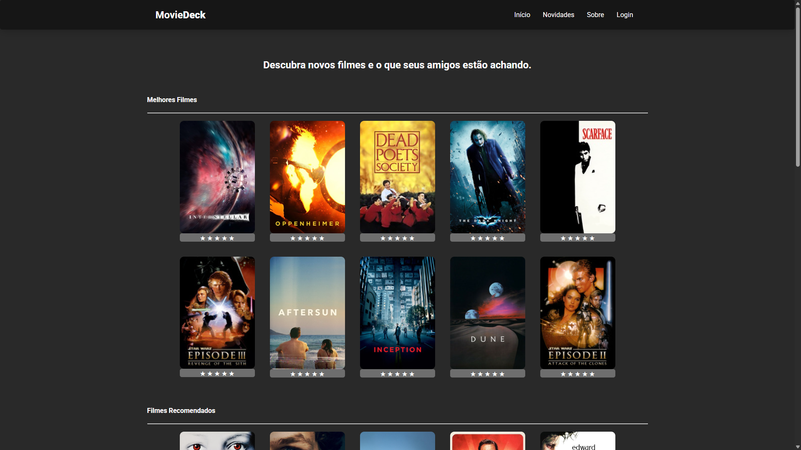

# MovieDeck

## Visão Geral do Projeto

MovieDeck é um projeto desenvolvido para a disciplina de Web I, que simula um espaço onde os usuários podem registrar e avaliar filmes que assistiram. O objetivo principal deste trabalho é demonstrar habilidades em **HTML** para estruturação do conteúdo e **CSS** para estilização, criando uma interface visualmente atraente e intuitiva.

Atualmente, o projeto é **apenas visual** e não possui funcionalidades de cadastro de usuário, login ou persistência de dados. Ele serve como uma prova de conceito para a criação de layouts responsivos e design web.

---

## Funcionalidades (Visuais)

* **Listagem de Filmes:** Apresenta um layout para exibir filmes assistidos, conforme visualizado abaixo.
* **Avaliação:** Permite visualizar um sistema de avaliação para cada filme.
* **Detalhes do Filme:** Simula a apresentação de informações básicas sobre cada filme.

---

## Visual do Projeto

Essa é a página inicial do MovieDeck, mostrando a listagem de filmes:

---

## Tecnologias Utilizadas

* **HTML5:** Utilizado para a estrutura e conteúdo da página.
* **CSS3:** Empregado para estilização, layout e responsividade do site.

---
